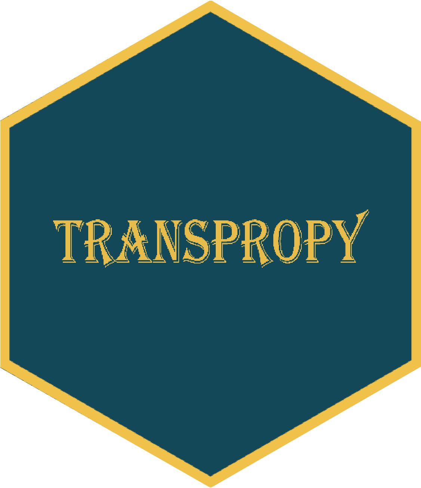

# TransProPy

A python package that integrate algorithms and various machine learning approaches to extract features (genes) effective for classification and attribute them accordingly.

## Installation

```bash
pip3 install TransProPy
pip3 install git+https://github.com/SSSYDYSSS/TransProPy.git
```

## Usage
```python 
# e.g.: 
from TransProCalc import my_function
my_function()
```

## Citation
Yu Dongyue (2023). TransProPy: A python package that integrate algorithms and various machine learning approaches to extract features (genes) effective for classification and attribute them accordingly.

https://github.com/SSSYDYSSS/TransProPy,
https://sssydysss.github.io/TransProPyBook/.

## More examples see
TransProPy Manual：https://sssydysss.github.io/TransProPyBook/

## Contributing
Pull requests are welcome. For major changes, please open an issue first to discuss what you would like to change.

## License
This project is licensed under the BSD 3-Clause License - see the [LICENSE.txt](./LICENSE.txt) file for details.

